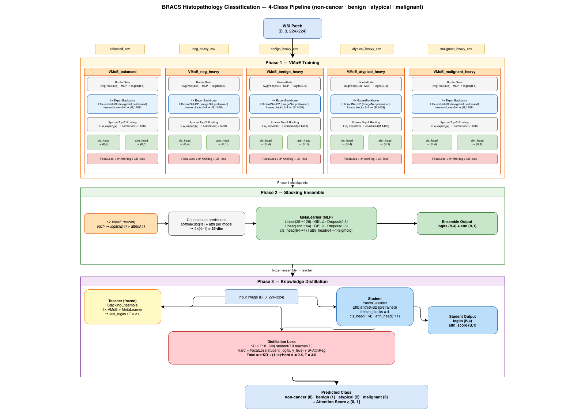

# WSI VMoE Classifier

A four-class histopathology classification pipeline for the **BRACS** dataset
(non-cancer · benign · atypical · malignant) built on top of
[CLAM](https://github.com/mahmoodlab/CLAM) (Lu et al., *Nature Biomedical Engineering*, 2021).

The pipeline combines **attention-guided pseudo-labeling** with a three-phase
training strategy: per-dataset Vision Mixture-of-Experts → stacking ensemble
→ knowledge distillation into a single student model.

---

## Architecture



The pipeline has four major stages:

| Stage | What happens |
|---|---|
| **CLAM** | Patch extraction, feature extraction, CLAM training |
| **Pseudo-labeling** | Per-patch attention scores drive label assignment |
| **Data preparation** | Five class-ratio variants built from pseudo-labeled patches |
| **VMoE training** | Three-phase: VMoE → ensemble → student distillation |

---

## Key Idea — Pseudo-labeling by Attention Score

CLAM assigns each patch an **attention weight** that reflects how much it
influenced the slide-level diagnosis.  High-attention patches sit in
diagnostically important tissue regions; low-attention patches are background
or ambiguous tissue.

We exploit this to build a patch-level training set without manual annotation:

1. **Train CLAM** on slide-level labels (benign / atypical / malignant).
2. **Extract per-patch attention scores** via `CLAM/create_csv.py`.
3. **Assign pseudo-labels** (`data_split.py`):
   - Top **10 %** attention → slide's true label (most informative tissue)
   - 10–30 % → **ignored** (ambiguous transition zone)
   - 30–40 % attention → slide's true label, **benign & atypical slides only**
     (boundary-region diversity; skipped for malignant where the margin is cleaner)
   - Bottom **40–100 %** → **non-cancer** (background / uninformative tissue)
   All thresholds and the set of labels that receive mid-band patches are
   configurable via CLI flags.
4. **Select** top-K / mid-band patch images with `filter_patches.py`.
5. **Boundary relabeling** (`prepare_datasets.py`): high-attention
   non-cancer patches near benign/atypical slides are re-assigned to the
   slide's true class, recovering transition-zone tissue examples.

Three pseudo-labeling thresholds are generated (top 10/15/20 %) to study
the effect of label noise on downstream training.

---

## Training Pipeline

### Phase 1 — Vision Mixture-of-Experts (VMoE)

One VMoE model is trained independently on each of the five class-ratio
dataset variants (balanced, neg-heavy, benign-heavy, atypical-heavy,
malignant-heavy).

Each VMoE uses an **EfficientNet-B2** backbone with four soft-gated experts.
Training uses a class-balanced focal loss with an optional uncertainty-weighted
attention-score regression head.  A `WeightedRandomSampler` ensures each
training batch contains roughly equal numbers of each class regardless of CSV
skew.

### Phase 2 — Stacking Ensemble

The five trained VMoE models are **frozen**.  A shallow meta-learner (two
linear layers) is trained on their concatenated softmax outputs to produce
the final slide-level prediction.  Training data is the validation split of
each VMoE dataset; the held-out test split is the ensemble's validation set.

Best ensemble checkpoint: **Macro F1 = 0.868** on the BRACS test set.

### Phase 3 — Knowledge Distillation

The stacking ensemble acts as a **teacher**.  A student `PatchClassifier`
(same EfficientNet-B2 backbone, lighter classification and attention heads)
is trained on the balanced dataset with a combined loss:

```
L = α · KL(student || teacher)  +  (1−α) · hard_focal_loss  +  β · huber_regression
```

The teacher is frozen throughout; only the student and the uncertainty
log-variance parameters are optimised.

---

## Repository Layout

```
.
├── CLAM/                         # CLAM pipeline (WSI → patches → features → model)
│   ├── create_csv.py             # Extract per-patch attention scores
│   ├── data_split.py             # Pseudo-label by attention percentile
│   ├── extract_patches.py        # Export 256×256 PNG patches from SVS slides
│   ├── extract_new_slides.py     # Process new slides for any label (CLI)
│   ├── filter_patches.py         # Select top-K / mid-band patches (CLI)
│   ├── cleanup.py                # Standardise label columns
│   ├── main.py                   # CLAM training entry point
│   ├── extract_features_fp.py    # Patch feature extraction (ResNet / UNI / CONCH)
│   ├── create_patches_fp.py      # Tissue segmentation & patching
│   └── ...                       # Original CLAM modules
│
├── configs/
│   ├── config.yaml               # 4-class pipeline config
│   └── config_3class.yaml        # 3-class variant
│
├── data/                         # Dataset & transform modules
├── models/                       # VMoE, StackingEnsemble, PatchClassifier, Student
├── losses/                       # Focal, distillation, supcon losses
├── trainers/                     # Base, VMoE, Ensemble, Distillation trainers
├── utils/                        # Metrics, logging helpers
│
├── prepare_datasets.py           # Build 5 class-ratio CSVs with boundary relabeling
├── merge_added_data.py           # Merge pseudo-labeled patch CSVs into main pool
├── train.py                      # Full 3-phase training (VMoE + ensemble + distillation)
├── train_cls_only.py             # Classification-only phases (no regression head)
├── evaluate.py                   # Evaluate any checkpoint on the test set
├── predict.py                    # Run inference on a single image or directory
├── compute_metrics.py            # Extended metrics report (AUC, kappa, confusion matrix)
├── requirements.txt              # VMoE pipeline dependencies
└── docs/
    └── architecture.png
```

---

## Installation

Two separate environments are required — one for CLAM (WSI processing) and
one for the VMoE training pipeline.

### CLAM environment

```bash
conda env create -f CLAM/env.yml        # creates 'clam_latest'
conda activate clam_latest
```

> `openslide` is installed via `conda-forge` and `openslide-python` via pip.
> Both are required for reading `.svs` slides.

### VMoE training environment

```bash
conda create -n torch python=3.11
conda activate torch
pip install -r requirements.txt
pip install h5py tqdm openslide-python   # extras needed by CLAM scripts
```

---

## How to Run

### Step 1 — Patch extraction (CLAM environment)

```bash
cd CLAM
conda activate clam_latest

# Segment tissue and create patch coordinates
python create_patches_fp.py \
    --source slide_data/ \
    --save_dir heatmaps/heatmap_raw_results/HEATMAP_OUTPUT \
    --patch_size 256 --seg --patch --stitch

# Extract patch features (UNI / CONCH / ResNet-50)
python extract_features_fp.py \
    --data_h5_dir  heatmaps/heatmap_raw_results/HEATMAP_OUTPUT \
    --data_slide_dir slide_data/ \
    --csv_path dataset_csv/sampled_bracs.csv \
    --feat_dir FEATURES_DIRECTORY \
    --model_name uni_v1
```

### Step 2 — Train CLAM and extract attention scores

```bash
# Train CLAM (creates results/bracs_subtype_clam_s1/)
python main.py \
    --data_root_dir FEATURES_DIRECTORY \
    --split_dir splits/ \
    --model_type clam_sb \
    --exp_code bracs_subtype_clam_s1

# Extract per-patch attention scores for all slides
python create_csv.py
# → attention_scores_all_slides.csv
```

### Step 3 — Pseudo-labeling and attention score filtering

Patches are labeled by their position in the per-slide attention ranking:

| Attention rank | Default range | Assigned label |
|---|---|---|
| Top region | 0 – 10 % | Slide's true label (benign / atypical / malignant) |
| Ignored zone | 10 – 30 % | Dropped |
| Mid-band | 30 – 40 % | Slide's true label — **benign & atypical only** |
| Background | 40 – 100 % | non-cancer |

```bash
# Default run (thresholds above)
python data_split.py
# → pseudo_labels.csv

# Override thresholds or which labels get mid-band patches
python data_split.py \
    --top-pct 15 --mid-start-pct 25 --mid-end-pct 45
python data_split.py \
    --mid-labels benign atypical malignant   # add malignant to mid-band

# For newly added slides of any label:
python extract_new_slides.py \
    --label atypical \
    --slides BRACS_001 BRACS_002 BRACS_003

# Select top-K / mid-band patch images per slide
python filter_patches.py \
    --label atypical \
    --top-k 1000 --mid-start 20 --mid-end 40

# Promote pseudo_label → label in merged dataset CSVs
python cleanup.py
```

### Step 4 — Extract patch images

```bash
python extract_patches.py
# Reads attention_scores_all_slides.csv, writes patch_dataset/{label}/*.png
```

### Step 5 — Build training datasets (VMoE environment)

```bash
cd ..          # back to repo root
conda activate torch

# Merge pseudo-labeled patches into the main pool
python merge_added_data.py

# Build 5 class-ratio CSVs with boundary relabeling
python prepare_datasets.py \
    --relabel-frac 0.20 \
    --multiplier 3.0
# → dataset_balanced_clean.csv
# → dataset_neg_heavy_clean.csv
# → dataset_benign_heavy_clean.csv
# → dataset_atypical_heavy_clean.csv
# → dataset_malignant_heavy_clean.csv
```

### Step 6 — Train (classification-only, recommended first run)

```bash
# Phase 1 (VMoE × 5 datasets) + Phase 2 (stacking ensemble)
python train_cls_only.py --config configs/config.yaml

# Resume Phase 2 with existing VMoE checkpoints
python train_cls_only.py --phase ensemble \
    --vmoe-ckpts \
        balanced:checkpoints/vmoe/epoch_xxx_f1_x.xxxx.pth \
        neg_heavy:checkpoints/vmoe/epoch_xxx_f1_x.xxxx.pth \
        benign_heavy:checkpoints/vmoe/epoch_xxx_f1_x.xxxx.pth \
        atypical_heavy:checkpoints/vmoe/epoch_xxx_f1_x.xxxx.pth \
        malignant_heavy:checkpoints/vmoe/epoch_xxx_f1_x.xxxx.pth
```

### Step 7 — Full pipeline with distillation

```bash
# All three phases
python train.py --config configs/config.yaml

# Phase 3 only (distillation from a specific ensemble checkpoint)
python train.py --phase distillation \
    --ensemble-ckpt checkpoints/ensemble/epoch_xxx_f1_x.xxxx.pth \
    --vmoe-ckpts \
        balanced:checkpoints/vmoe/epoch_xxx_f1_x.xxxx.pth \
        neg_heavy:checkpoints/vmoe/epoch_xxx_f1_x.xxxx.pth \
        benign_heavy:checkpoints/vmoe/epoch_xxx_f1_x.xxxx.pth \
        atypical_heavy:checkpoints/vmoe/epoch_xxx_f1_x.xxxx.pth \
        malignant_heavy:checkpoints/vmoe/epoch_xxx_f1_x.xxxx.pth
```

### Step 8 — Evaluate and report

```bash
python evaluate.py \
    --checkpoint checkpoints/ensemble/epoch_xxx_f1_x.xxxx.pth \
    --split test

python compute_metrics.py \
    --checkpoint checkpoints/ensemble/epoch_xxx_f1_x.xxxx.pth
```

---

## Results

All results are reported on the held-out BRACS test set (2,025 samples, 4 classes).
The **default pipeline** uses classification-only training (no regression head) with
percentile-normalized attention scores for pseudo-labeling.

---

### Main Results — Stacking Ensemble (default)

| Metric | Value |
|---|:---:|
| Macro F1 | **0.8507** |
| Weighted F1 | 0.8620 |
| Top-1 Accuracy | 0.8622 |
| Top-2 Accuracy | 0.9719 |
| Macro AUC-ROC | 0.9634 |
| Matthews CC | 0.8183 |
| Cohen's Kappa | 0.8146 |

**Per-class breakdown:**

| Class | Precision | Recall | F1 | AUC-ROC |
|---|:---:|:---:|:---:|:---:|
| non-cancer | 0.7661 | 0.9640 | 0.8537 | 0.9764 |
| benign | 0.9426 | 0.7628 | 0.8432 | 0.9527 |
| atypical | 0.7500 | 0.7584 | 0.7542 | 0.9312 |
| malignant | 0.9517 | 0.9517 | 0.9517 | 0.9934 |
| **macro avg** | 0.8526 | 0.8592 | 0.8507 | — |

Atypical is the hardest class — 20.5 % of true atypical patches are misclassified as
non-cancer, consistent with its visual overlap with normal epithelium.
Malignant achieves the highest F1 (0.9517) and the largest centroid separation from all
other classes in the meta-learner feature space (min Euclidean distance 2.06).

---

### Phase 1 — VMoE Specialist Performance

Each VMoE is trained on one class-ratio variant.
No single specialist performs well across all four classes; ensemble diversity is the key.

| Dataset | Macro F1 | Non-cancer F1 | Benign F1 | Atypical F1 | Malignant F1 |
|---|:---:|:---:|:---:|:---:|:---:|
| Balanced | 0.517 | 0.701 | 0.380 | 0.384 | 0.604 |
| Negative-heavy | 0.443 | 0.649 | 0.583 | 0.429 | 0.112 |
| **Benign-heavy** | **0.725** | 0.822 | **0.856** | 0.496 | 0.727 |
| Atypical-heavy | 0.383 | 0.666 | 0.244 | 0.323 | 0.298 |
| Malignant-heavy | 0.627 | 0.788 | 0.411 | 0.380 | **0.929** |

The benign-heavy specialist is the strongest individual model (0.725 macro F1).
The attention regression Spearman ρ is near zero across all VMoEs, indicating the
auxiliary regression task does not learn a meaningful ordering of CLAM attention scores.

---

### Ablation Studies

#### 1 · Pseudo-labeling vs No Pseudo-labeling

Removing pseudo-labeling (training on slide-level labels only) collapses ensemble
performance by **34 pp**:

| Model | Macro F1 | Benign F1 | Atypical F1 | Malignant F1 |
|---|:---:|:---:|:---:|:---:|
| No pseudo-labeling — balanced | 0.567 | 0.396 | 0.561 | 0.744 |
| No pseudo-labeling — benign-heavy | 0.557 | 0.548 | 0.645 | 0.479 |
| No pseudo-labeling — stacking ensemble | 0.498 | 0.478 | 0.537 | 0.480 |
| **With pseudo-labeling — stacking ensemble** | **0.839** | **0.832** | **0.727** | **0.941** |

Without pseudo-labeling, individual VMoEs overfit to slide-level noise, and the stacking
ensemble performs worse than even the balanced single model — confirming that patch-level
pseudo-labels from attention scores are the primary driver of performance.

#### 2 · Regression Task (Multi-Task vs Classification-Only)

Removing the attention-score regression head consistently improves classification:

| | Macro F1 | Macro AUC | Matthews CC | Cohen's Kappa |
|---|:---:|:---:|:---:|:---:|
| Multi-task (baseline — raw attention) | 0.8385 | 0.9590 | 0.8040 | 0.8001 |
| **Classification-only (default)** | **0.8507** | **0.9634** | **0.8183** | **0.8146** |
| Δ | +0.0122 | +0.0044 | +0.0143 | +0.0145 |

The regression head adds no useful signal because CLAM attention scores are computed on
slide-level features, not the patch-level features used here.

#### 3 · Attention Score Normalization (Raw vs Percentile)

Replacing raw attention scores with per-slide percentile ranks for pseudo-labeling
yields consistent gains at the VMoE level and modest improvements at the ensemble level:

**VMoE specialists:**

| Dataset | Raw Macro F1 | Percentile Macro F1 | Δ |
|---|:---:|:---:|:---:|
| Balanced | 0.517 | 0.536 | +0.019 |
| Negative-heavy | 0.443 | **0.831** | **+0.388** |
| Benign-heavy | 0.725 | 0.773 | +0.048 |
| Atypical-heavy | 0.383 | 0.738 | +0.355 |
| Malignant-heavy | 0.627 | 0.650 | +0.023 |

**Stacking ensemble:**

| Metric | Raw (baseline) | Percentile-normalized | Δ |
|---|:---:|:---:|:---:|
| Macro F1 | 0.8385 | 0.8398 | +0.0013 |
| Macro AUC-ROC | 0.9590 | 0.9642 | +0.0052 |
| Matthews CC | 0.8040 | 0.8048 | +0.0008 |
| **Spearman ρ (attn)** | −0.1162 | **0.8045** | **+0.921** |
| **Pearson r (attn)** | −0.0183 | **0.9550** | **+0.973** |

Percentile normalization is most impactful for the individual VMoEs (+38.8 pp for
negative-heavy) while ensemble gains are modest but consistent across all metrics.
The dramatic improvement in attention correlation (Spearman ρ: −0.12 → 0.80) confirms
that percentile normalization makes the pseudo-label signal far more transferable.

#### 4 · Averaging vs Stacking Ensemble

| Model | Macro F1 | Weighted F1 | Macro AUC | MCC | Kappa |
|---|:---:|:---:|:---:|:---:|:---:|
| Averaging ensemble | 0.8349 | 0.8463 | 0.9666 | 0.7957 | 0.7918 |
| **Stacking ensemble** | **0.8385** | **0.8506** | 0.9590 | **0.8040** | **0.8001** |

Per-class F1 — Averaging vs Stacking:

| Class | Averaging | Stacking | Δ |
|---|:---:|:---:|:---:|
| non-cancer | 0.8361 | 0.8549 | +0.019 |
| benign | **0.8354** | 0.8315 | −0.004 |
| atypical | **0.7397** | 0.7268 | −0.013 |
| malignant | 0.9284 | **0.9407** | +0.012 |

The near-parity result (0.4 pp gap) supports the interpretation that ensemble diversity
across five biased VMoEs — not the learned stacking weights — drives most of the gain.
The meta-learner adds consistent marginal improvements except on atypical, where
averaging slightly outperforms (+1.3 pp), suggesting the stacking weights
over-calibrate toward easier classes.

---

## Configuration

All training hyper-parameters live in `configs/config.yaml`.
Key sections:

```yaml
training:
  vmoe:
    epochs: 30
    batch_size: 32
    learning_rate: 1.0e-3
    patience: 7

  ensemble:
    epochs: 20
    batch_size: 64
    learning_rate: 1.0e-3

  distillation:
    epochs: 50
    temperature: 3.0
    alpha: 0.6          # weight of soft KD loss vs hard focal loss
    patience: 12
    unfreeze_epoch: 15  # unfreeze student backbone at this epoch
```

A 3-class variant (benign · atypical · malignant, dropping non-cancer) is
available via `--config configs/config_3class.yaml`.

---

## References

**BRACS** — the dataset used in this work:

> Brancati, N., Anniciello, A.M., Pati, P. et al. *BRACS: A Dataset for BReAst Carcinoma
> Subtyping in H&E Histology Images.*
> **Database (Oxford)** 2022, baac093 (2022).
> https://doi.org/10.1093/database/baac093

```bibtex
@article{brancati2022bracs,
  title={{BRACS}: A Dataset for {BReAst} Carcinoma Subtyping in {H\&E} Histology Images},
  author={Brancati, Nadia and Anniciello, Anna Maria and Pati, Pushpak and Riccio, Daniel and Scognamiglio, Giose{\`{u}}e and Jaume, Guillaume and De Pietro, Giuseppe and Di Bonito, Maurizio and Foncubierta, Antonio and Botti, Gerardo and Gabrani, Maria and Feroce, Florinda and Frucci, Maria},
  journal={Database},
  volume={2022},
  pages={baac093},
  year={2022},
  publisher={Oxford Academic},
  doi={10.1093/database/baac093}
}
```

---

**CLAM** — the weakly-supervised MIL framework this pipeline is built on:

> Lu, M.Y., Williamson, D.F.K., Chen, T.Y. et al. *Data-efficient and weakly supervised
> computational pathology on whole-slide images.*
> **Nature Biomedical Engineering** 5, 555–570 (2021).
> https://doi.org/10.1038/s41551-020-00682-w

```bibtex
@article{lu2021data,
  title={Data-efficient and weakly supervised computational pathology on whole-slide images},
  author={Lu, Ming Y and Williamson, Drew FK and Chen, Tiffany Y and Chen, Richard J and Barbieri, Matteo and Mahmood, Faisal},
  journal={Nature Biomedical Engineering},
  volume={5},
  pages={555--570},
  year={2021},
  publisher={Nature Publishing Group}
}
```
